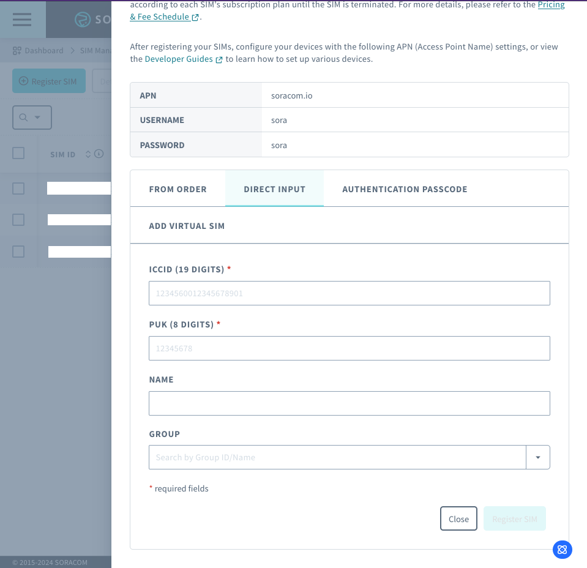
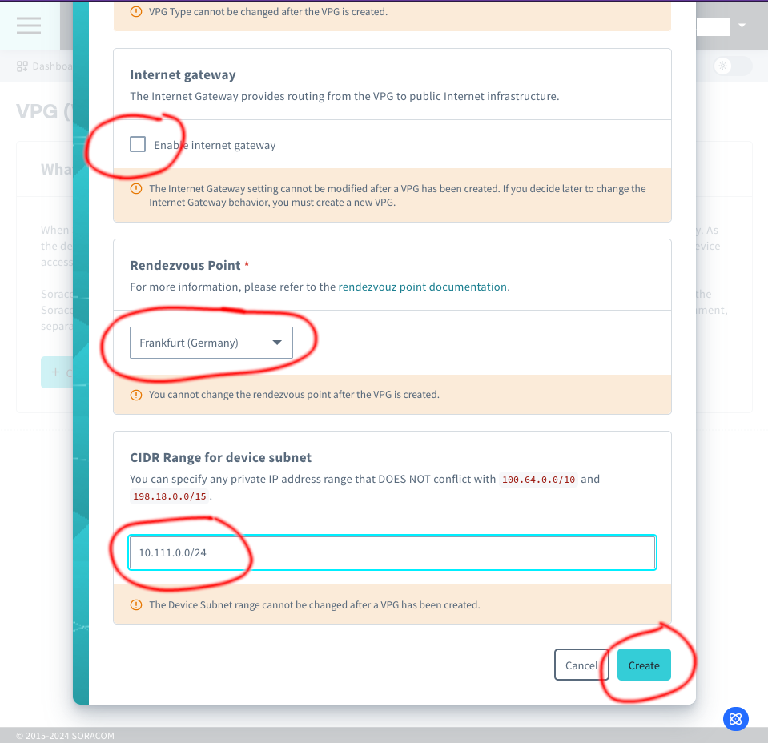
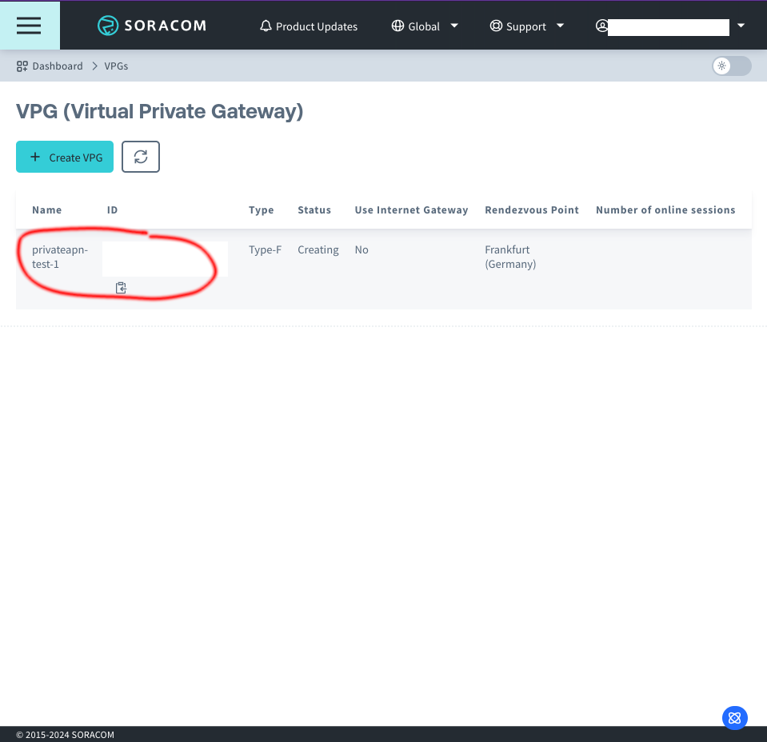
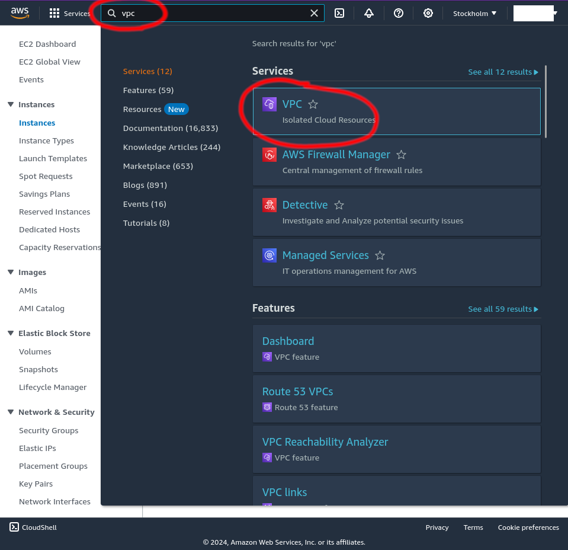

# Soracom.io

## Set up Soracom.io Private APN

Soracom's Private APN service is called "Virtual Private Gateway (VPG)". It can be configured from the Soracom web portal. 

The Soracom platform runs on AWS and instead of a VPN it uses AWS VPC peering to connect the Private APN to other systems. You can read more from  (You can use Soracom with an VPN, but that requires setting up through Soracom customer service.)

AWS VPC peering is easiest to set up when your server is also running on AWS. This tutorial assumes that you already have an AWS EC2 instance set up.

To configure the Soracom.io Private APN, first login to the  web portal.


Select Menu to access different functionalities.


First you need to add a SIM card to your Soracom account from "SIM Management"


Select "Register SIM" to add a new SIM



Add the ICCID and PUK codes that can be found from the physical SIM card packaging. Add a new to remember the SIM card (sim-1 etc. you can also write the name/number to the physical SIM with a marker). Create a group for SIMs to be added to the Private APN


Next select "VPG" from the menu.


Select "Create VPG"


Select the VPG type "Type-F".



Unselect the "Enable internet gateway". Select any Randezvous point, but you might want to prefer one close to your AWS location.

Set the device subnet something you would like your SIM cards to get IP addressess from. For example, 10.111.0.0/24



You can now select your newly created VPG


You need to configure multiple settings from the VPG. Take a note of the "VPG CIDR" value


From "Basic Settings" you need to add the SIM card group you created earlier to the VPG


From "Closed Network" you need to add a VPC Peering connection to connect the VPG to your AWS VPC.



To add the connection you need to login to your AWS console and select "VPC" from the search bar


Select "Your VPCs"


Select the VPC you would like to use. You will have one VPC by default.


Take note of the following values:
 * VPC ID
 * Owner ID
 * IPv4 CIDR
 * Main routing table


Back at the Soracom portal you can add a VPC connection. Use the VPC ID, Owner ID and IPv4 CIDR you got from your AWS.


Next at the AWS VPC dashboard select "Peering connections". You will find a pending request from soracom. Select the request and actions.


Select "Accept request"


Take note of the "Requester CIDRs" and select "Accept request"


Next select "Routing tables" and select the route table that your VPC uses.


Select "Edit routes"


Select "Add route" and use the Soracom VPG CIDR value as the destination. The select the target as "Peering Connection" and select the peering connection that soracom made. Select "Save changes"


You should now see the route to Soracom VPG.


From Soracom VPG select "Device Lan" and set Gate to "On". Select Save.


Scroll down on the "Device Lan" page and select "Add Gate Peer". 

You will need to know your AWS EC2 instance IP address. You can do this by running "ip a" command on the EC2 instance you want the traffic to go.

```
$ ip a
1: lo: <LOOPBACK,UP,LOWER_UP> mtu 65536 qdisc noqueue state UNKNOWN group default qlen 1000
    link/loopback 00:00:00:00:00:00 brd 00:00:00:00:00:00
    inet 127.0.0.1/8 scope host lo
       valid_lft forever preferred_lft forever
    inet6 ::1/128 scope host noprefixroute 
       valid_lft forever preferred_lft forever
2: ens5: <BROADCAST,MULTICAST,UP,LOWER_UP> mtu 9001 qdisc mq state UP group default qlen 1000
    link/ether 0a:cb:71:04:48:dd brd ff:ff:ff:ff:ff:ff
    altname enp0s5
    inet 172.31.38.0/20 metric 100 brd 172.31.47.255 scope global dynamic ens5
       valid_lft 1912sec preferred_lft 1912sec
    inet6 fe80::8cb:71ff:fe04:48dd/64 scope link 
       valid_lft forever preferred_lft forever
```

Set the "Device subnet IP address" as something in your SIM card IP address range.

Select "Create"


You will then see a window showing how to create the tunnel on the EC2 instance.


From VPG select "Junction settings" and set the "Soracom Junction: Redirection" On. Set the AWS EC2 instance device subnet IP as the Gateway for the devices.

This will make your AWS EC2 instance be the Gateway for the SIM cards. All SIM card data will go to the AWS EC2 instance.


Lastly, if you want the SIM cards to have static IPs, go to "Device Lan" tab and scroll to the bottom. Select "Add IP address" and set an IP address from the device lan range for the SIM card.

# Setup a "Gate peer" on your AWS EC2 instance

Login to the EC2 instance you used as your gateway.

```
$ ip a 
1: lo: <LOOPBACK,UP,LOWER_UP> mtu 65536 qdisc noqueue state UNKNOWN group default qlen 1000 
    link/loopback 00:00:00:00:00:00 brd 00:00:00:00:00:00 
    inet 127.0.0.1/8 scope host lo 
       valid_lft forever preferred_lft forever 
    inet6 ::1/128 scope host noprefixroute  
       valid_lft forever preferred_lft forever 
2: ens5: <BROADCAST,MULTICAST,UP,LOWER_UP> mtu 9001 qdisc mq state UP group default qlen 1000 
    link/ether 0a:cb:71:04:48:dd brd ff:ff:ff:ff:ff:ff 
    altname enp0s5 
    inet 172.31.38.0/20 metric 100 brd 172.31.47.255 scope global dynamic ens5 
       valid_lft 1912sec preferred_lft 1912sec 
    inet6 fe80::8cb:71ff:fe04:48dd/64 scope link  
       valid_lft forever preferred_lft forever
```

If your EC2 instance is running Debian instead of the Amazon Linux, you can use the "gate_init_vxlan_debian.sh from this repo. If you use Amazon Linux, you can download the script from 

Run the gate_init_vxlan script with the values from "ip a" and from the VPG 
```
$ sudo ./gate_init_vxlan.sh ens5 `#Network interface name of gate peer` 172.31.38.0 vxlan0 10.111.0.200 24 `#Subnet mask for the device subnet IP address range` 10 100.67.0.224 100.67.0.228
Cannot find device "vxlan0"
- Creating vxlan interface vxlan0

- Flushing previously added fdb entries

- Setting IP address of vxlan0 to 10.111.0.200

- Registering 100.67.0.224 as a peer
- Registering 100.67.0.228 as a peer
```

Set up NAT to forward device traffic to the internet

```
$ sudo iptables -t nat -A POSTROUTING -o ens5 -s 10.111.0.3 -j MASQUERADE 
`
```

Connect the SIM card to a device. Now you should see the device traffic on the vxlan0 interface
```
$ sudo tcpdump -n -i vxlan0 
22:26:18.251013 ARP, Reply 10.111.0.3 is-at da:7e:77:ef:df:25, length 28 
22:25:49.434377 IP 10.111.0.3.61387 > 17.57.146.54.5223: Flags [S], seq 2067749794, win 65535, options [mss 1338,nop,wscale 6,nop,nop,TS val 1156705512 ecr 0,sackOK,eol], length 0 
22:25:49.458347 IP 17.57.146.54.5223 > 10.111.0.3.61387: Flags [S.], seq 2553298588, ack 2067749795, win 65160, options [mss 1460,sackOK,TS val 1598973978 ecr 1156705512,nop,wscale 7], length 0 
```

You can also set up a WireGuard server to send the SIM traffic to a remote machine such as a Kali Linux laptop. Follow the instructions in 
