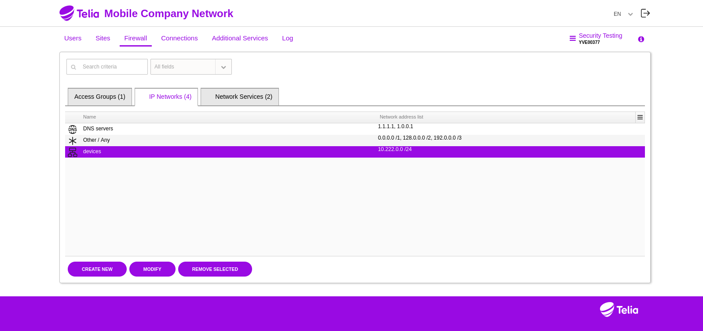

# Telia.fi

## Set up Telia.fi Private APN

Telia.fi's Private APN service is called "Mobile company network". It can be selected from the Telia Business portal from "Other Telia services". You need to sign a service contract to use the service.


After completing the service contract you get access to the Mobile company network self-service portal. From the portal you can see all Telia.fi mobile subscriptions and connect them to the Mobile company network. You can also change the network settings.


First, you need to add an access group for devices to allow them to connect outside of the Private APN. 


Go to "Firewall" > "Access Groups" and select "Create new"


Set a name to the group and select "Use the access group for default of new users"


You can leave "Source" empty


Add "Internet" to destination to allow the devices to connect to anywhere. You might also want to add "ICMP" to the allowed protocols.



Go to "Firewall" > "IP Networks" and add an IP network to be used for the devices. In this example, the IP network "10.222.0.0/24" is used, but you can select any IP range.


Go to "Connections" and delete the default NAT rule that connect the Private APN to the Internet.


Go to "Connections" and create a new LAN-to-LAN VPN connection.


Set the "VPN setting profile" to "Route-based IKEv2 default-route". Leave "IP addresses" empty and generate a secure secret to be used as the IPSEC key. For example, with "openssl rand -base64 32"

Set the "Gateway" as your server where you want the Private APN connections to be sent to.


Go to "Users" and select a mobile subscription you want to be redirect to the Private APN. Click "Add to corporate network"


Choose an IP address from the IP range defined earlier. For example, "10.222.0.1"

Select "Redirect data connection to corporate network"

Click "Save"

Now the device should connect to the Private APN and have its data sent through the IPSEC tunnel to your server.

On the server you can set up the IPSEC server with the following configuration:

Install prerequisites:

```
sudo apt install strongswan
```

Use the following configuration but change the 123.123.123.123 to the IP address of your server and the PSK to the same key you have used in the Private APN.

/etc/ipsec.conf
```
config setup
        charondebug="all"
        uniqueids=yes
conn privateapn
        type=tunnel
        auto=start
        keyexchange=ikev2
        authby=secret
        left=%any
	      leftid=123.123.123.123
	      leftsubnet=0.0.0.0/0
        right=194.89.156.1
        rightsubnet=10.222.0.0/24
        ike=aes256-sha1-modp1024!
        esp=aes256-sha1!
        ikelifetime=86400s
        lifetime=3600s
```
/etc/ipsec.secrets 
```
123.123.123.123 194.89.156.1 : PSK "v+NkxY9LLZvwj4qCC2o/gGrWDF2d21jL"
```

Start the IPSEC server

```
sudo systemctl enable --now strongswan-starter.service
```

Check that the IPSEC connection has been made

```
sudo ipsec statusall
```
```
Connections:
  privateapn:  %any...194.89.156.1  IKEv2
  privateapn:   local:  [123.123.123.123] uses pre-shared key authentication
  privateapn:   remote: [194.89.156.1] uses pre-shared key authentication
  privateapn:   child:  0.0.0.0/0 === 10.222.0.0/24 TUNNEL
Security Associations (1 up, 0 connecting):
  privateapn[682]: ESTABLISHED 2 hours ago, 172.31.38.0[123.123.123.123]...194.89.156.1[194.89.156.1]
```


