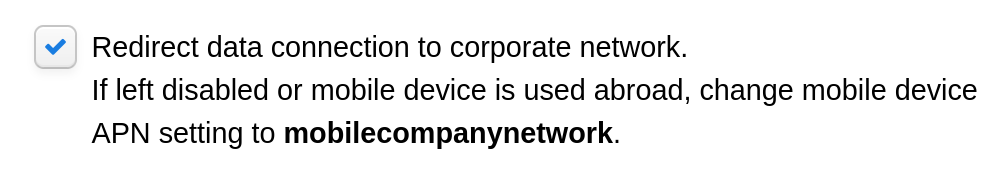
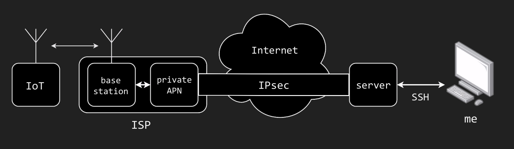

# privateAPN

Set of tools and documentation for leveraging private APNs for mobile network traffic analysis

## DEF CON 32

Presented at DEF CON 32 on August 9 2024

DEF CON 32 YouTube: Coming soon!
<!--
[YouTube: DEF CON 32 - Leveraging private APNs for mobile network traffic analysis - Aapo Oksman](https://www.youtube.com/watch?v=)
-->

[DEF CON 32 slides.pdf](https://media.defcon.org/DEF%20CON%2032/DEF%20CON%2032%20presentations/DEF%20CON%2032%20-%20Aapo%20Oksman%20-%20Leveraging%20private%20APNs%20for%20mobile%20network%20traffic%20analysis.pdf)

[DEF CON 32 demo.mp4](https://media.defcon.org/DEF%20CON%2032/DEF%20CON%2032%20presentations/DEF%20CON%2032%20-%20Aapo%20Oksman%20-%20Leveraging%20private%20APNs%20for%20mobile%20network%20traffic%20analysis%20demo.mp4)

## Private APNs

Mobile devices connect to the Internet using mobile networks provided by Internet Service Providers (ISPs). The devices connect to the ISP mobile networks with Access Point Names (APNs) that is usually just "Internet" and just connects the device directly to the Internet. 

Many ISPs have begun offering private APNs to allow you to have a private network inside the ISP infrastructure. By renting a private APN and redirecting all device traffic to your own server, you can easily intercept and tamper with mobile device network traffic.

This repository has instructions and tools on how to do this.

## Private APNs offered by ISPs

| ISP | Private APN cost | Country | Data cost | Network operator | Can force APN settings? | Notes |
|---|---|---|---|---|---|---|
|  | 100€ setup + 140€/month | EU(/Global) | ??? | ??? | No, APN settings must be set on SIM/device | Not thoroughly tested outside Finland |
|  | 100€ setup + 140€/month | Finland | 5€/month for slow, 1.5€/day when used for fast | Telia | Yes, if set on the private APN configuration |   |
|  | $10 setup + $0.75/hour | Global | [Soracom carriers & pricing](https://developers.soracom.io/en/docs/reference/carriers/) | [Soracom carriers & pricing](https://developers.soracom.io/en/docs/reference/carriers/) | No, APN settings must be set on SIM/device | Some network operators don't seem to need proper APN settings, See "Soracom Finland". Not thoroughly tested outside Finland |
|  | $10 setup + $0.75/hour | Finland | $0.05/MB | Telia & DNA | Yes, by default | Even though Soracom says to use their APN settings, on this network device APN settings don't seem to matter at all and the device connects to the private APN with any APN settings |
|  | $10 setup + $0.75/hour | Finland | $0.05/MB | Elisa | No, APN settings must be set on SIM/device |  |
|   |   |   |   |   |   |   |

### "Can force APN settings?" 

This means that the ISP/Network operator will not care what APN settings the device has configured and will redirect the device to the private APN anyway. For example, with the following setting on the ISP configuration:

## Configuring a Private APN and intercepting data

First select the ISP you want to use from the above list. Click the ISP name for documentation on how to set up the Private APN and connect it to your server. In the instructions AWS based cloud server is used.

After connecting the private APN to your server you can either monitor the traffic on the server of connect the devices to other computers through a WireGuard tunnel:

You can setup the WireGuard connections with the setup found in 
