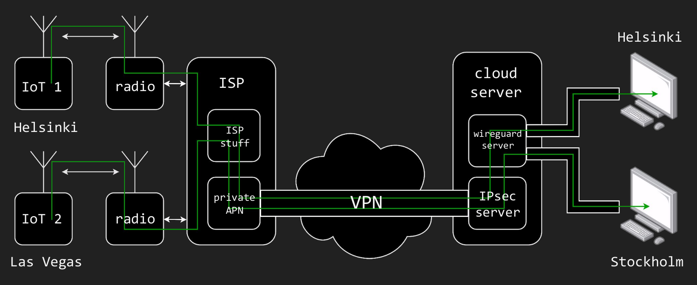

# WireGuard server to route SIM card IP traffic to WireGuard clients



## Install prerequisites

```
sudo apt install wireguard wireguard-tools
```

Ensure that the following settings are enabled in /etc/sysctl.conf
```
net.ipv4.ip_forward=1
net.ipv4.conf.all.accept_redirects = 0
net.ipv4.conf.all.send_redirects = 0
```

Reload the sysctl.conf if necessary
```
sudo sysctl --system
```

## Generate WireGuard configurations

Edit the privateapn-wireguard-generator.bash to match your setup.

You need to set the serverip and check that your SIM card IPs are on the 10.222.0.0/24 subnet or you need to change the generator

```
vim privateapn-wireguard-generator.bash
bash privateapn-wireguard-generator.bash
```

You will get the following WireGuard configurations:

SIM006Server.wg.conf
```
#SIM 006 Server
[Interface]
Address    = 10.222.6.254/24
ListenPort = 52006
#PublicKey = cHrmI1CXLRJHPaYiImYORljAVsG2Is1aa9nrdRL/TEA=
Privatekey = GAW3cx+pzc3WfT1qtL299l5IZzaGOQzUxv79XtzrdnU=
Table      = off
PostUp     = ip rule flush table 6
PostUp     = ip rule add from 10.222.0.6/32 table 6
PostUp     = ip route add default via 10.222.6.6 table 6

#SIM 006 Client
[Peer]
PublicKey   = LwVSOr+IArlWfG6oROZf8FMopblH/Wd+bqR7c5MDnR0=
AllowedIPs  = 10.222.6.6/32, 0.0.0.0/0
```
SIM006Client.wg.conf
```
#SIM 006 Client
[Interface]
#PublicKey = LwVSOr+IArlWfG6oROZf8FMopblH/Wd+bqR7c5MDnR0=
Privatekey = 6GzgXKpDLnEqdrtY9sKnlKYbW/hs8rexn8hsSaj5b3w=
Address    = 10.222.6.6/32
Table      = off
PostUp     = ip -4 route add 10.222.0.6/32 dev SIM1.wg

#SIM 006 Server
[Peer]
PublicKey = cHrmI1CXLRJHPaYiImYORljAVsG2Is1aa9nrdRL/TEA=
AllowedIPs = 0.0.0.0/0
Endpoint = 123.123.123.123:52006
PersistentKeepalive = 20
```

This will set an additional routing table for each SIM card source IP. The default route for each SIM IP will be the WireGuard client of the SIM card.
